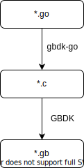
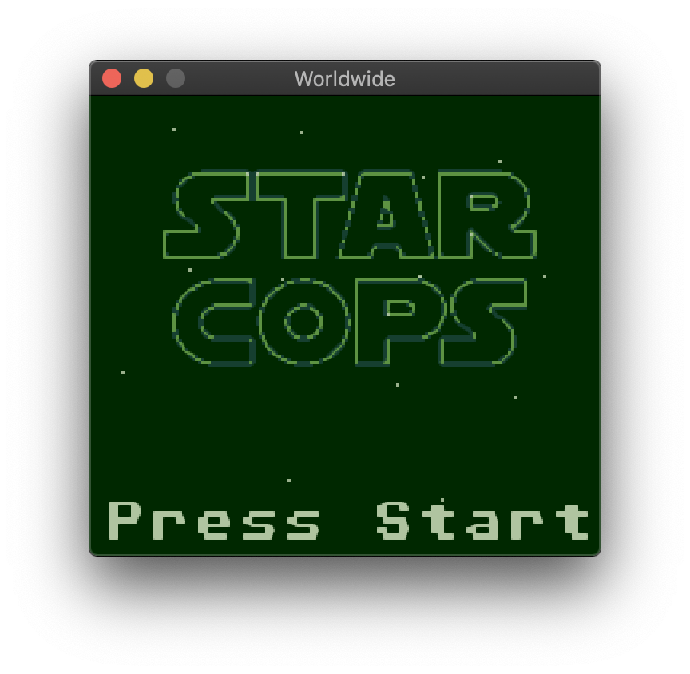

# gbdk-go

gbdk-go is a Go binding for GBDK. You can do GameBoy software development with Go.

## Architecture



gbdk-go compiles Go source code and outputs C code.

The output C code is built into GB ROM by GBDK.

```go
package main

import "github.com/Akatsuki-py/gbdk-go/api/stdio"

func main() {
	stdio.Printf("Hello World!")
	stdio.Printf("\n\nPress Start")
}
```

The above Go code is compiled into the following C code.

```c
#include <stdio.h>
void main() {
    printf("Hello World!");
    printf("\n\nPress Start");
}
```

## Install

You need to build binary from source.

Requirements:
- Go 1.14
- Make

```sh
$ git clone https://github.com/Akatsuki-py/gbdk-go.git
$ cd ./gbdk-go
$ make
```

## Usage

Requirements:
- gbdk-go/gbdkgo
- gbdk-go/go2c
- gbdk-go/gbdk2020

They must be in the same directory.

If you are doing the above Install step, there should be no problem.

```sh
$ gbdkgo [options] dir
```

#### Example

```sh
$ gbdkgo example/simple_shmup
```



## API

[gbdk-go API](https://pkg.go.dev/github.com/Akatsuki-py/gbdk-go/api@v0.0.1)

The API is basically a GBDK binding.

Some are not yet implemented.

## Project rules

- `./main.go` main file in project. `./main.c` in gbdk.
- `./**.go` sub file in project. `./**.c` in gbdk.
- `./asset/**.go` asset file in project. these file is converted into `asset.h`

You must create a Go directory project according to above format. 

The directory structure also needs to be specific.

## Linter

Although gbdk-go allows GB development with Go, there are some grammars such as defer and goroutine that cannot be used. 

So I'm going to write a linter for gbdk-go.

## Performance warning

gbdk-go outputs GB ROM with C in between.

When using C language, the performance is greatly inferior compared to the raw assembly.

You should read [to_c_or_not_to_c.md](https://gist.github.com/ISSOtm/4f4d335c3fd258ad0dfc7d4d615409fd).
